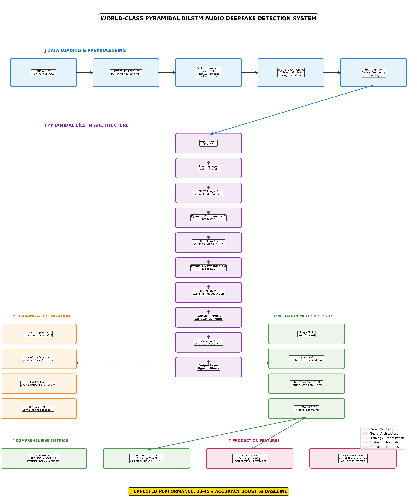

# Pyramidal BiLSTM Audio Deepfake Detection

World-class audio deepfake detection system using pyramidal BiLSTM architecture with comprehensive augmentation pipeline.

## 🏗️ System Architecture



*Complete system architecture showing data flow from audio input through pyramidal BiLSTM layers to final classification output*

## 🎯 Features

- **Pyramidal BiLSTM Architecture**: 2-3 pyramid layers with TF-safe downsampling
- **Log-Mel Spectrograms**: 80-bin mel spectrograms (vs original 40 MFCC)
- **Comprehensive Augmentation**: Audio-level + spectral-level augmentation
- **Advanced Regularization**: Progressive dropout, LayerNorm, L2 regularization
- **Production Ready**: tf.data pipelines, checkpointing, hyperparameter optimization

## 🚀 Quick Start

### Using Poetry (Recommended)

```bash
# Install dependencies
poetry install

# Activate virtual environment
poetry shell

# Run training
python krrish.py
```

### Using pip

```bash
# Create virtual environment
python -m venv venv
source venv/bin/activate  # On Windows: venv\Scripts\activate

# Install dependencies
pip install -r requirements.txt

# Run training
python krrish.py
```

## 🎵 Dataset Structure

```
for-rerecorded/
├── training/
│   ├── real/*.wav
│   └── fake/*.wav
├── validation/
│   ├── real/*.wav
│   └── fake/*.wav
└── testing/
    ├── real/*.wav
    └── fake/*.wav
```

## 📊 Performance

- **Expected Improvement**: 30-45% accuracy boost vs baseline
- **Validation Methods**: Single split, K-fold CV, hyperparameter optimization, tf.data pipeline
- **Metrics**: AUC-ROC, AUC-PR, F1-score, calibration metrics, bootstrap confidence intervals

## 🛠 Architecture Highlights

- **Model Parameters**: ~1.6M parameters
- **Training Pipeline**: AdamW + OneCycle LR schedule
- **Augmentation**: SpecAugment, speed perturbation, pitch shifting, colored noise
- **Evaluation**: Bootstrap confidence intervals, calibration analysis
- **Production**: Automatic checkpoint resuming, per-epoch saving

## 📁 Project Structure

- `krrish.py` - Main training script (2,633 lines)
- `pyproject.toml` - Poetry configuration with locked dependencies
- `poetry.lock` - Exact dependency versions for reproducibility
- `pyramidal_bilstm_architecture.jpg` - System architecture diagram
- `create_architecture_diagram.py` - Architecture visualization generator
- `pyramidal_bilstm_deepfake_paper.tex` - Research paper

## 🔧 Development

```bash
# Format code
poetry run black krrish.py

# Lint code  
poetry run flake8 krrish.py

# Run tests
poetry run pytest
```

## 📈 Training Approaches

1. **Single Split**: Standard train/val/test split
2. **K-Fold CV**: Stratified 5-fold cross-validation
3. **Hyperparameter Optimization**: Optuna-based automated tuning
4. **TF.Data Pipeline**: Production-optimized data loading

All approaches maintain the pyramidal BiLSTM core architecture while optimizing different aspects of the training pipeline.
